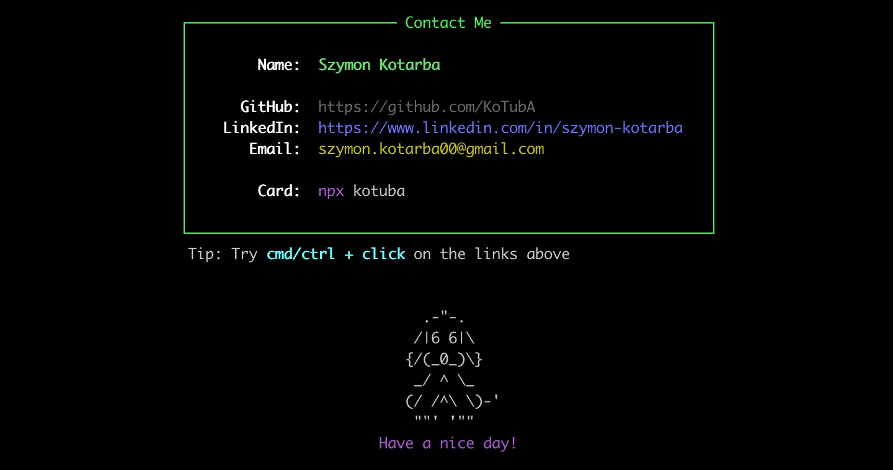

# Business Card CLI

This npm package enables you to showcase my contact details in your terminal with a visually captivating layout.

## Usage

To access my business card in the terminal, execute the following command:

````bash
npx kotuba
````

## Screenshot
The final output might look something like this:



## Steps to Create Your Own

If you want to create your own CLI tool similar to this one, you can follow the steps outlined in the [official Node.js documentation](https://nodejs.org/en/docs/guides/getting-started-guide/) and [npm documentation](https://docs.npmjs.com/). Additionally, you can explore various libraries such as [chalk](https://www.npmjs.com/package/chalk) and [boxen](https://www.npmjs.com/package/boxen) to enhance the visual presentation of your CLI card.


For a more detailed step-by-step guide, you can also check out this tutorial: [Building a Business Card CLI Tool](https://whitep4nth3r.com/blog/build-a-business-card-cli-tool/).

